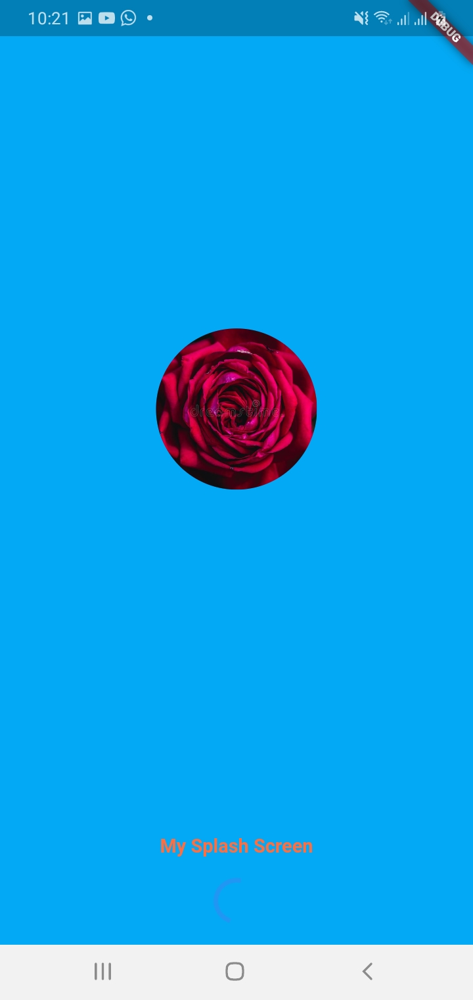
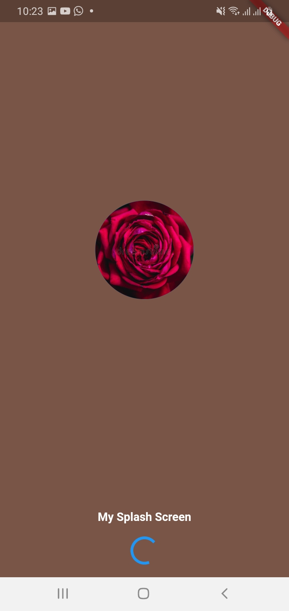

# Usage

You can use the mysplashscreen package. This works both on iOS and Android.

## Example

```flutter
import 'package:mysplashscreen/mysplashscreen.dart';

home: MySplashScreen(
          loadtimeSec: 10,
          loading: true,
          nextscreen: Gonext(),
          backcolor: Colors.brown,
          bottomtext: 'My Splash Screen',
          bottomtextstyle: TextStyle(
              color: Colors.white, fontSize: 15, fontWeight: FontWeight.bold),
        ));
```
 You can user Asset image also , Ex:using assetimage:"assets/image.png" 



[Exmaple Project](https://github.com/pilojanmobile/SplashScreenExmaple)

## License
[MIT](https://choosealicense.com/licenses/mit/)
